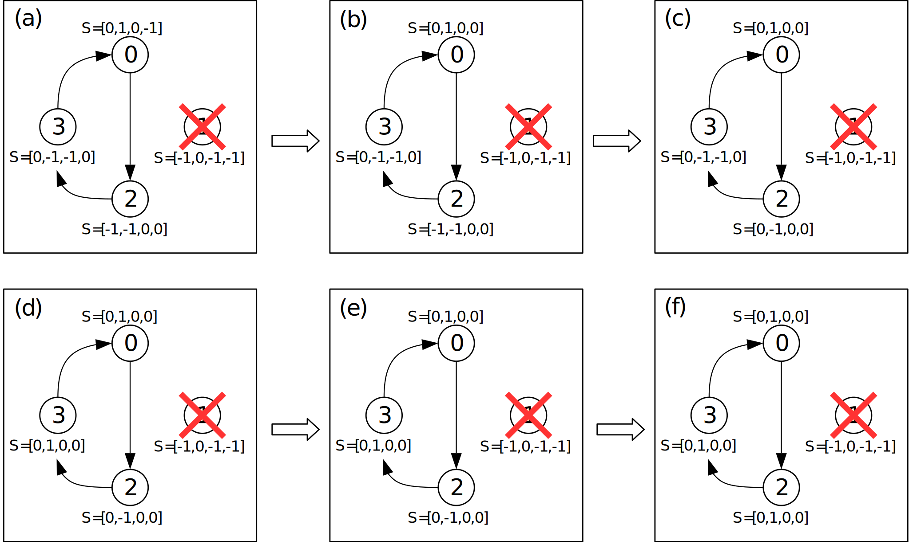

# Trabalho prático 0

## Proposta

**Tarefas para aprender a usar a ferramenta de simulação SMPL**

* Há N nodos (processos)
* Cada processo conta o "tempo" independentemente
* Há três tipos de eventos:
  * test (teste)
  * fault (falha)
  * recovery (recuperação)
* O intervalo entre os testes é de 30 unidades de tempo
* Fora os testes, são agendados 2 eventos
  * Uma falha no tempo 31 para o processo 1
  * Uma recuperação no tempo 61 para o processo 1
* Execução: `tempo <numero de processos>`

## Tarefas

* **Tarefa 0**: digitar, compilar e executar o programa exemplo, `tempo.c`
  * [Código](tempo.c.txt) |  [Log](saida0.txt)
* **Tarefa 1**: fazer cada um dos processos testar o seguinte no anel
  * Implemente o teste com a função `status()` do SMPL e imprimir (`printf`) o resultado de cada teste executado
  * Por exemplo: “O processo i testou o processo j correto no tempo tal.”
  * [Código](tempo1.c.txt) |  [Relatório](#tarefa-1) |  [Log](saida1.txt)
* **Tarefa 2**: cada processo correto executa testes até achar outro processo correto.
  * Lembre-se de tratar o caso em que todos os demais processos estão falhos\*.
  * Imprimir os testes e resultados.
  * [Código](tempo2.c.txt) |  [Relatório](#tarefa-2) |  [Log](saida2.txt) |  [\*Log](saida2.2.txt)
* **Tarefa 3**: cada processo mantém localmente o vetor State\[N\]
  * Inicializa o State\[N\] com -1 (indicando estado “unknown”) para todos os demais processos e 0 para o próprio processo.
  * Ao executar um teste, o processo atualiza a entrada correspondente no vetor State\[N\].
  * Em cada intervalo de testes, mostrar o vetor State\[N\].
  * [Código](tempo3.c.txt) |  [Relatório](#tarefa-3) |  [Log](saida3.txt)
* **Tarefa 4**: Quando um processo correto testar outro processo correto, obter as informações de diagnóstico do processo testado sobre todos os processos do sistema exceto aqueles que testou nesta rodada, além do próprio testador.
  * [Código](tempo4.c.txt) |  [Relatório](#tarefa-4) |  [Log](saida4.txt)


## Tarefa 1

Nesta tarefa cada processo correto testa o seguinte no anel. Como exemplo de funcionamento, considera-se 4 processos numerados de 0 a 3 (Figura 1 (a)). É importante observar que nessa etapa, se um processo estiver falho (Figura 1 (b)) ele não testa o próximo, então pode ser que em alguns momentos não se forme um anel.


Figura 1 - Exemplo para tarefa 1

### No código:

* Aproveitando os recursos da biblioteca SMPL, ao criar a `struct TipoProcesso`, coloca-se nela um campo chamado `id` que receberá um identificador de facility (recurso) do SMPL.
* `processo` é o vetor do tipo `TipoProcesso` que apontara para cada um dos processos criados.
* O programa receberá como `argv[1]` durante sua chamada o número de processos para a simulação.
* Os eventos no programa serão agendados através da função `schedule(int ev, real te, int tkn)`.
* Há um loop `while` no código que executa enquanto o tempo for menor que o programado como duração da simulação.
* Utilizam-se 3 tipos de eventos `test` (teste), `fault` (falha) e `recovery` (recuperação).
  * Para testar um evento é usada a função `int status(int f)` que retorna 0 em caso de um processo correto um valor diferente de 0 para um processo falho.
  * Para tornar um processo falho, utiliza-se a função `int request(int f, int tkn, int pri)` que reserva a facility do processo e torna `status != 0`.
  * Para mudar o estado de um processo para recuperado, utiliza-se a função `void release(int f, int tkn)` que libera a facility ocupada pelo processo e torna `status = 0`.
  * A função `void cause(int *ev, int *tkn)` é responsável por disparar cada um dos eventos agendados.
* Para facilitar a compreensão do código, são definidas duas variáveis: `num_processo_atual` que recerá o valor de `token` (relativo ao processo atual) e `num_proximo_processo`, que recebe o valor (token+1)%N.
  * (token+1)%N retorna sempre o número do próximo processo e considera a condição "circular" (do anel), por isso é utilizado o módulo N para N processos.

## Tarefa 2

Nesta tarefa, cada processo correto executa testes até achar outro processo correto. Como exemplo de funcionamento, considera-se 4 processos numerados de 0 a 3, com o processo 1 falho no momento do início da execução (Figura 2 (a)). O processo 0 testa o processo 1 e detecta que o mesmo está falho (b). Em seguida, o processo 0 testa o processo 2 e detecta que ele está correto (c). Neste momento o processo 0 para os testes, pois encontrou o processo 2 correto. O processo 2 testa o processo 3 e detecta que ele está correto (d), então para os testes. Por fim, o processo 3 testa o processo 0, que está correto e o anel se forma. O algoritmo continua até atingir o tempo limite, sendo possível que o anel se modifique caso algum processo falhe ou se recupere.


Figura 2 - Exemplo de passos para tarefa 2

### No código:

* Para compreender a totalidade do código, favor ler o conteúdo _"No código"_ da Tarefa 1
* A diferença desta tarefa para a Tarefa 1 é que um processo correto irá executar testes até achar outro processo correto. Para isso, foi utilizado um loop `while` que verifica o estado dos processos seguintes enquanto ele for diferente de 0 (ou seja, enquanto o processo testado for falho).
  * Para tratar o caso em que todos os demais processos estão falhos, é feita a seguinte verificação `if (num_proximo_processo==num_processo_atual)` e nesse caso é exibida uma mensagem avisando que há um único processo correto.
  * Para atualizar o valor do próximo processo é utilizada a mesma ideia que incrementa o valor de `token` na tarefa anterior: `num_proximo_processo = (num_proximo_processo+1)%N;`

## Tarefa 3

* Nesta tarefa, cada processo mantém localmente o vetor State\[N\] que representa o estado de todos os N processos. State N é inicializado com o valor -1, indicando que o estado dos processos é desconhecido ou "unknown", exceto para o próprio processo ao qual o vetor pertence, que é inicializado com o valor 0 (o processo considera que ele mesmo está correto)(a). Ao realizar testes cada processo atualiza seu vetor State\[N\] com os resultados de teste que ele executa. Como exemplo de funcionamento, considera-se 4 processos numerados de 0 a 3, com o processo 1 falho no momento do início da execução (Figura 3 (a)) e os vetores de todos os processos não possuem ainda qualquer informação sobre os estados dos outros processos.
* Em (b), o processo 0 testa o processo 1 e detecta falha, por isso o vetor de 0 é atualizado com \[0, 1, -1, -1\], onde o primeiro 0 representa o estado correto do próprio processo 0, o segundo 1 representa falha no processo 1 e os valores -1 representam os status desconhecidos para os processos 2 e 3.
* Em seguida (c), o processo 0 testa o processo 2, que está correto, então ele atualiza seu vetor para \[0, 1, 0, -1\], sendo o segundo 0 correspondente ao estado correto do processo 2. Como o processo 0 encontrou um processo correto, ele para os testes.
* Em (d), o processo 1 iria testar, mas como ele está falho, não o faz.
* Em (e) o processo 2 testa o processo 3, que está correto. Então o vetor de estados do processo 2 é atualizado para \[-1, -1, 0, 0\], onde os valores -1 representam que não há informação sobre o estado dos processos 0 e 1, o primeiro valor 0, representa que o processo 2 tem o próprio estado como correto e o segundo valor 0, que testou o processo 3 como correto. Uma vez que o processo 2 testou um processo correto, segue o algoritmo como o processo 3 testando.
* Em (f), o processo 3 testa o próximo, que é o processo 0. O vetor State do processo 3 é atualizado para \[0, -1, -1, 0\] pois o processo 3 testou o processo 0 correto (primeiro 0), não conhece o estado dos processos 1 e 2 (os valores -1) e tem seu próprio estado como correto(o último 0). O algoritmo continua até atingir o tempo limite, sendo possível que o anel se modifique caso algum processo falhe ou se recupere.


Figura 3 - Exemplo de passos para tarefa 3

### No código:

* Para compreender a totalidade do código, favor ler os conteúdos _"No código"_ da Tarefa 1 e _"No código"_ da Tarefa 2
* A diferença desta tarefa para a Tarefa 2 é que cada processo manterá um vetor de estados `State[]` dos demais processos, indicando se eles tem valor desconhecido (-1), estão corretos (0) ou falhos (1)
  * Para a criação/inicilização do vetor `State` são utilizados 2 laços `for` aninhados. O externo corresponde a iteração entre cada processo e o interno corresponde a iteração entre cada posição no vetor `State` do estado em questão.
  ```c
  for (i=0;i<N;i++) {
      processo[i].State = (int*) malloc(sizeof(int)*N); //aloca espaço para o estado de cada processo que é guardado no vetor State
      for (int j=0; j < N; j++)
      {
          processo[i].State[j]=desconhecido; // inicializa o estado de cada processo como "desconhecido" ou -1
      }
  }
  ```
* Sempre que um processo correto for testar, ele executa testes até encontrar o próximo processo correto, marcando os processos testados como falhos com o valor 1.

### Tarefa 4

* Nesta tarefa, quando um processo correto testar outro processo correto, ele obtem também as informações de diagnóstico do processo testado sobre todos os processos do sistema exceto aqueles que testou nesta rodada. Como exemplo de funcionamento, considera-se 4 processos numerados de 0 a 3, com o processo 1 falho.
* Na Figura 4 (a) há um exemplo em que se parte de um momento em que todos os nós já testaram uma vez e o próximo processo a testar é o 0.
* Em (b) o processo 0 testa o processo 1, que continua falho, portanto não precisa atualizar o estado do processo 1 e nem obter nenhuma informação do vetor de estados do processo 1. Em seguida, o processo 0 testa o processo 2, que está correto e a partir do vetor de estados de 2 S=\[-1, -1, 0, 0\], obtem o estado do processo 3, atualizando seu próprio vetor de estados para \[0, 1, 0, 0\], onde o último 0 corresponde ao processo 3 correto.
* Em (c), o processo 2 testa o processo 3 que continua correto e a partir do vetor de estados do processo 3 S=\[0, -1, -1, 0\], atualiza seu próprio vetor para S=\[0, -1, 0, 0\], onde o primeiro 0 corresponde ao estado correto do processo 0.
* Em (d), o processo 3 testa 0 e como este está correto, o processo 3 atualiza seu próprio vetor de estados a partir das novas informações que pode obter do vetor de estados do processo 0 S=\[0, 1, 0, 0\]. O vetor de estados do processo 3 fica, portanto, \[0, 1, 0, 0\], onde o valor 1 representa o processo 1 falho e o valor 0 em seguida, representa o vetor 2 correto.
* Em (e), o processo 0 testa novamente o processo 1, que continua falho e portanto segue testando o processo 2. Este está correto e como não houve alterações no estado dos processos, ele mantem seu vetor.
* Em (f), o processo 2 testa o 3 correto, e dessa forma atualiza seu vetor para S=\[0,1,0,0\] com a informação que ainda não tinha sobre o processo 1 (falho), obtida do vetor de estados do processo testado 3 S=\[0, 1, 0, 0\]. É interessante notar que chegou-se a um ponto em que todos os vetores de estados dos processo são iguais (f) e até que algum processo falhe ou se recupere os vetores permacenecerão dessa forma.


Figura 4 - Exemplo de passos para tarefa 4

**No código:**

* Para compreender a totalidade do código, favor ler os conteúdos _"No código"_ da Tarefa 1, _"No código"_ da Tarefa 2 e _"No código"_ da Tarefa 3
* A diferença desta tarefa para a Tarefa 3 é que quando um processo correto testa outro processo correto, obtém as informações de diagnóstico do processo testado sobre todos os processos do sistema exceto aqueles que testou nesta rodada.
  * Isso é feito copiando os valores dos elementos do vetor `State` do processo em teste para os elementos equivalentes do vetor `State` do processo testador. Nesse caso é importante estabelecer os limites (para o laço `for`) até onde as cópias devem ocorrer para que o loop não dê mais de uma "volta" no anel. Temos dois casos:
    * Se o número do processo testado for menor que o número do processo testador, o `limite` é o próprio processo testador
    * Se o número do processo testado for maior que o número do processo testador, o `limite` é o número do processo atual+N
    * Isso é válido porque dentro do laço `for` utiliza-se o valor `i%N`
    ```c
    for (i=num_proximo_processo+1;i<limite;i++) { //parte do próximo processo (ou processo testado), e incrementa o valor de i até o limite estabelecido
        if (processo[num_proximo_processo].State[i%N]!=desconhecido)// Se o processo atual ainda não conhece os dados dos outros processos, ele os obtém do vetor de dados do processo que está testando
        {
            processo[num_processo_atual].State[i%N]=processo[num_proximo_processo].State[i%N]; //realiza a cópia do valor para a mesma posição (elemento)
        }
    }
    ```

# Licença

Este código está liberado sob a licença MIT. O texto dela (em inglês) encontra-se [neste arquivo](../LICENSE.md).
