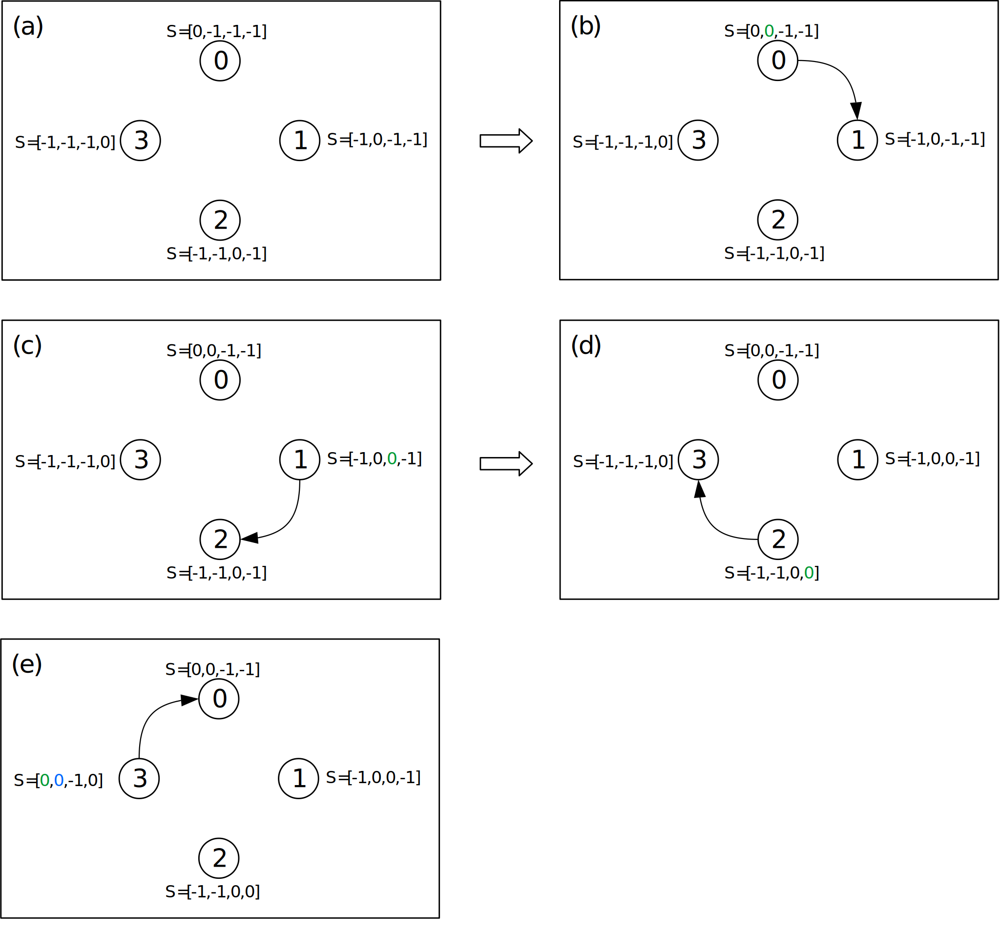
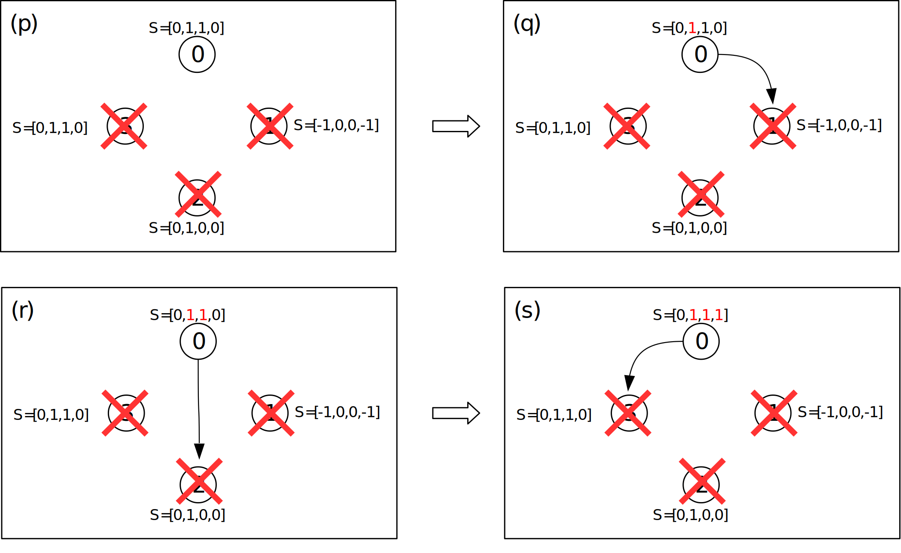
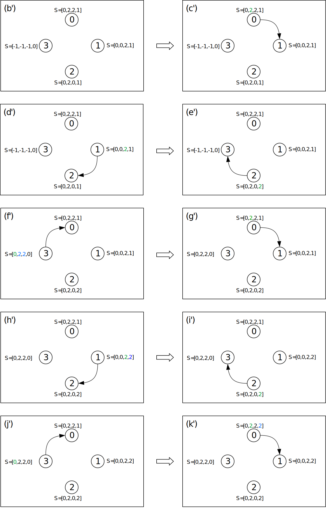

# Trabalho prático 1

## Proposta

**Implementar o algoritmo VRing no ambiente de simulação SMPL**

* Mostre resultados para diversos valores de N e diversos eventos
  * Um evento em um processo de cada vez, um evento só ocorre depois do evento anterior ser diagnosticado.
  * Para cada evento mostre claramente o número de testes executados e a latência para completar o diagnóstico do evento.
* Cada nodo mantém o vetor `STATE[0..N-1]` de contadores de eventos
  * `STATE[0..N-1]` é inicializado em -1 (estado “unknown”)
  * Assume-se que os processos são inicializados sem-falha
    * A entrada correspondente ao próprio processo no vetor `STATE[]` do testador é setada para zero.
  * Ao descobrir um novo evento em um nodo testado, o testador incrementa a entrada correspondente no vetor `STATE[]`.
* Para a transferência de informações de diagnóstico lembre-se da estratégia do VRing:
  * Quando um processo sem-falha testa outro processo sem-falha obtém informações sobre os estados de todos os processos que não testou no intervalo de testes corrente.
  * É importante comparar as entradas correspondentes dos vetores `STATE` (testador e testado) para saber se o testado tem alguma novidade.
    * Se o valor da entrada for maior no vetor `STATE` do processo testado, então copia a informação.

## Código

* [Código](VRing.c)
  * Execução: `VRing <numero de processos> <tempo de execução>`

### Logs

[Log 1](saida1.txt):

* 3 processos
* Tempo de simulação > 151
* Falhas
  * processo 1 no instante 40
  * processo 2 no instante 89
* Recuperações
  * processo 2 no instante 91
  * processo 1 no instante 130

[Log 2](saida2.txt):

* 4 processos
* Tempo de simulação > 330
* Falhas
  * processo 1 no instante 31
  * processo 2 no instante 91
  * processo 3 no instante 121
* Recuperações
  * processo 1 no instante 181
  * processo 2 no instante 241
  * processo 3 no instante 301

[Log 3](saida3.txt):

* 6 processos
* Tempo de simulação > 511
* Falhas
  * processo 1 no instante 31
  * processo 2 no instante 151
  * processo 4 no instante 331
* Recuperações
  * processo 2 no instante 241
  * processo 4 no instante 391
  * processo 1 no instante 451

## Como funciona?

Para facilitar a compreensão, as figuras abaixo ilustram o mesmo exemplo presente no Log 2. O vetor `State[]` de cada processo é representado por `S[]` nas figuras a seguir. As cores dos valores representam:

* vermelho: processo falho identificado diretamente pelo testador
* verde: processo correto identificado diretamente pelo testador
* azul: processo cujo estado foi obtido via outro processo testado (o estado foi copiado para o vetor `State[]` do processo testador)

Considere a Figura 1:

* Em (a) o vetor `State[N]` é inicializado com -1 (indicando estado “unknown”) para todos os demais processos e 0 para o próprio processo.
* Em (b) o processo 0 testa o processo 1 correto e atualiza a posição equivalente no seu vetor `State`. Como o processo 1 não tem nenhuma informação mais nova sobre os outros processos (os demais valores no vetor `State` do processo 1 são menores que os do vetor `State` do processo 0), nenhum dado adicional é coletado. O vetor `State` do processo 0 agora é `State[0, 0, -1, -1]`.
* Em (c) o processo 1 testa o processo 2 correto e atualiza a posição equivalente no seu vetor `State`. Como o processo 2 não tem nenhuma informação mais nova sobre os outros processos (os demais valores no vetor `State` do processo 2 são menores que os do vetor `State` do processo 1), nenhum dado adicional é coletado. O vetor `State` do processo 1 agora é `State[-1, 0, 0, -1]`.
* Em (d) o processo 2 testa o processo 3 correto e atualiza a posição equivalente no seu vetor `State`. Como o processo 3 não tem nenhuma informação mais nova sobre os outros processos (os demais valores no vetor `State` do processo 3 são menores que os do vetor `State` do processo 2), nenhum dado adicional é coletado. O vetor `State` do processo 2 agora é `State[-1, -1, 0, 0]`.
* Em (e) o processo 3 testa o processo 0 correto e atualiza a posição equivalente no seu vetor `State`. Como o processo 0 tem informação mais nova sobre o processo 1 (este valor no vetor `State` do processo 0 é maior que o correspondente no vetor `State` do processo 3), o processo 3 atualiza o estado do proceso 1 no seu próprio vetor `State` a partir da informação obtida do processo 0. O vetor `State` do processo 3 agora é `State[0, 0, -1, 0]`.

Na Figura 1, ocorre uma rodada de testes, pois cada processo correto testou outro processo correto.



Considere agora a Figura 2:

* Em (e) os vetores `State` de todos os processos contém as mesmas informações que a Figura 1 (e), mas aqui o processo 1 apresenta uma falha logo em seguida.
* Em (f) o processo 0 testa o processo 1 falho e portanto nenhum dado adicional é coletado. O vetor `State` do processo 0 agora é `State[0, 1, -1, -1]`.
* Como em (f) o processo 0 ainda não havia encontrado um processo correto, ele segue, em (g), testando o processo 2, que está correto. Como o processo 2 tem informação mais nova sobre o processo 3 (este valor no vetor `State` do processo 2 é maior que o correspondente no vetor `State` do processo 0), o processo 0 atualiza o estado do proceso 3 no seu próprio vetor `State` a partir da informação obtida do processo 2. O vetor `State` do processo 0 agora é `State[0, 1, 0, 0]`.
* Em (h) o processo 2 testa o processo 3 correto e mantém a posição equivalente no seu vetor `State`. Como o processo 3 tem informações mais novas sobre os processos 0 e 1 (estes valores no vetor `State` do processo 3 são maiores que os correspondentes no vetor `State` do processo 2), o processo 2 atualiza o estado dos procesos 0 e 1 no seu próprio vetor `State` a partir das informações obtidas do processo 3. O vetor `State` do processo 2 agora é `State[0, 0, 0, 0]`.
* Em (i) o processo 3 testa o processo 0 correto e mantém a posição equivalente no seu vetor `State`. Como o processo 0 tem informações mais novas sobre os processos 1 e 2 (estes valores no vetor `State` do processo 0 são maiores que os correspondentes no vetor `State` do processo 3), o processo 3 atualiza o estado dos procesos 1 e 2 no seu próprio vetor `State` a partir das informações obtidas do processo 0. O vetor `State` do processo 3 agora é `State[0, 1, 0, 0]`.
* Em (j) o processo 0 testa o processo 1, que continua falho, e portanto nenhum dado adicional é coletado. O vetor `State` do processo 0 continua o mesmo.
* Como em (j) o processo 0 não testou um processo correto, ele segue, em (k), testando o processo 2, que está correto. Como o processo 2 não tem nenhuma informação mais nova sobre os outros processos (os demais valores no vetor `State` do processo 2 são menores que os do vetor `State` do processo 0), nenhum dado adicional é coletado. O vetor `State` do processo 0 se mantém.
* Em (l) o processo 2 testa o processo 3 correto e mantém a posição equivalente no seu vetor `State`. Como o processo 3 tem informação mais nova sobre o processo 1 (este valor no vetor `State` do processo 3 é maior que o correspondente no vetor `State` do processo 2), o processo 2 atualiza o estado do proceso 1 no seu próprio vetor `State` a partir das informações obtidas do processo 3. O vetor `State` do processo 2 agora é `State[0, 1, 0, 0]`.

Na Figura 2 houve o diagnóstico do evento de falha (valor ímpar) para o processo 1 pois todos os processos corretos tem a informação de falha do processo 1 em seus vetores `State`.


Considere agora a Figura 3:

* Em (l) os vetores `State` de todos os processos contém as mesmas informações que a Figura 2 (l), mas aqui o processo 2 apresenta uma falha logo em seguida.
* Em (m) o processo 0 testa o processo 1, que continua falho, e portanto nenhum dado adicional é coletado. O vetor `State` do processo 0 continua o mesmo.
* Como em (m) o processo 0 não testou um processo correto, ele segue, em (n), testando o processo 2. Como o processo 2 está falho, o processo 0 atualiza seu vetor `State` para `State[0, 1, 1, 0]` e nenhum dado adicional é coletado.
* Como em (n) o processo 0 ainda não testou um processo correto, ele segue, em (o), testando o processo 3. Como o processo 3 permanece correto, mas não tem nenhuma informação mais nova sobre os outros processos (os demais valores no vetor `State` do processo 3 são menores que os do vetor `State` do processo 0), nenhum dado adicional é coletado. O vetor `State` do processo 0 é mantido.
* Em (p) o processo 3 testa o processo 0 correto e mantém a posição equivalente no seu vetor `State`. Como o processo 0 tem informações mais novas sobre o processo 2 (este valor no vetor `State` do processo 0 é maior que o correspondente no vetor `State` do processo 3), o processo 3 atualiza o estado do proceso 2 no seu próprio vetor `State` a partir da informação obtida do processo 0. O vetor `State` do processo 3 agora é `State[0, 1, 1, 0]`.

Na Figura 3 houve o diagnóstico do evento de falha no processo 2 pois todos os processos corretos tem a informação de falha (valor ímpar) para o processo 2 em seus vetores `State`.


Considere agora a Figura 4:

* Em (p) os vetores `State` de todos os processos contém as mesmas informações que a Figura 3 (p), mas aqui o processo 3 apresenta uma falha logo em seguida.
* Em (q) o processo 0 testa o processo 1, que continua falho, e portanto nenhum dado adicional é coletado. O vetor `State` do processo 0 continua o mesmo.
* Como em (q) o processo 0 não testou um processo correto, ele segue, em (r), testando o processo 2. O processo 0 testa o processo 2, que continua falho, e portanto nenhum dado adicional é coletado. O vetor `State` do processo 0 continua o mesmo.
* Como em (r) o processo 0 não testou um processo correto, ele segue, em (s), testando o processo 3. O processo 0 testa o processo 3, que está falho, e portanto nenhum dado adicional é coletado. O vetor `State` do processo 0 agora é `State[0, 1, 1, 1]`.

Na Figura 4 houve o diagnóstico do evento de falha no processo 3 pois todos os processos corretos tem a informação de falha (valor ímpar) para o processo 3 em seus vetores `State`. Neste caso, o processo 0 é o único correto.



Considere agora a Figura 5:

* Em (s) os vetores `State` de todos os processos contém as mesmas informações que a Figura 4 (s), mas aqui o processo 1 apresenta uma recuperação logo em seguida.
* Em (t) o processo 0 testa o processo 1 correto e atualiza a posição equivalente no seu vetor `State`. Como o processo 1 não tem nenhuma informação mais nova sobre os outros processos (seu vetor de estados foi resetado devido à falha anterior, portanto os demais valores no vetor `State` do processo 1 são menores que os do vetor `State` do processo 0), nenhum dado adicional é coletado. O vetor `State` do processo 0 agora é `State[0, 2, 1, 1]`.
* Em (u) o processo 1 testa o processo 2 falho e atualiza a posição equivalente no seu vetor `State`. Como o processo 2 está falho, nenhum dado adicional é coletado. O vetor `State` do processo 1 agora é `State[-1, 0, 1, -1]`.
* Como em (u) o processo 1 não testou um processo correto, ele segue, em (v), testando o processo 3, que está falho e dessa forma nenhum dado adicional é coletado. O vetor `State` do processo 1 agora é `State[-1, 0, 1, 1]`.
* Como em (v) o processo 1 não testou um processo correto, ele segue, em (w), testando o processo 0, que está correto. Como o processo 0 não tem nenhuma informação mais nova sobre os outros processos (os demais valores no vetor `State` do processo 0 são iguais aos do vetor `State` do processo 1), nenhum dado adicional é coletado. O vetor `State` do processo 1 agora é `State[0, 0, 1, 1]`.

Na Figura 5 houve o diagnóstico do evento de recuperação no processo 1 pois todos os processos corretos tem a informação de recuperação (valor par) para o processo 1 em seus vetores `State`.


Considere agora a Figura 6:

* Em (w) os vetores `State` de todos os processos contém as mesmas informações que a Figura 5 (w), mas aqui o processo 2 apresenta uma recuperação logo em seguida.
* Em (x) o processo 0 testa o processo 1 correto e mantém a posição equivalente no seu vetor `State`. Como o processo 1 não tem nenhuma informação mais nova sobre os outros processos (os demais valores no vetor `State` do processo 1 são iguais aos do vetor `State` do processo 0), nenhum dado adicional é coletado. O vetor `State` do processo 0 se mantém.
* Em (y) o processo 1 testa o processo 2 correto e atualiza a posição equivalente no seu vetor `State`. Como o processo 2 não tem nenhuma informação mais nova sobre os outros processos (seu vetor de estados foi resetado devido à falha anterior, portanto os demais valores no vetor `State` do processo 2 são menores que os do vetor `State` do processo 1), nenhum dado adicional é coletado. O vetor `State` do processo 1 agora é `State[0, 0, 2, 1]`.
* Em (z) o processo 2 testa o processo 3 falho e portanto nenhum dado adicional é coletado. O vetor `State` do processo 2 agora é `State[-1, -1, 0, 1]`.
* Como em (z) o processo 2 não testou um processo correto, ele segue, em (a'), testando o processo 0, que está correto. Como o processo 0 tem informações mais novas sobre o processo 1 (este valor no vetor `State` do processo 0 é maior que o correspondente no vetor `State` do processo 2), o processo 2 atualiza o estado do proceso 1 no seu próprio vetor `State` a partir da informação obtida do processo 0. O vetor `State` do processo 2 agora é `State[0, 2, 0, 1]`.
* Em (b') o processo 0 testa o processo 1 correto e mantém a posição equivalente no seu vetor `State`. Como o processo 1 tem informações mais novas sobre o processo 2 (este valor no vetor `State` do processo 1 é maior que o correspondente no vetor `State` do processo 0), o processo 0 atualiza o estado do proceso 2 no seu próprio vetor `State` a partir da informação obtida do processo 1. O vetor `State` do processo 0 agora é `State[0, 2, 2, 1]`.

Na Figura 6 houve o diagnóstico do evento de recuperação no processo 2 pois todos os processos corretos tem a informação de recuperação (valor par) para o processo 2 em seus vetores `State`.


Considere agora a Figura 7:

* Em (b') os vetores `State` de todos os processos contém as mesmas informações que a Figura 6 (b'), mas aqui o processo 3 apresenta uma recuperação logo em seguida.
* Em (c') o processo 0 testa o processo 1 correto e mantém a posição equivalente no seu vetor `State`. Como o processo 1 não tem nenhuma informação mais nova sobre os outros processos (os demais valores no vetor `State` do processo 1 são iguais aos do vetor `State` do processo 0), nenhum dado adicional é coletado. O vetor `State` do processo 0 se mantém.
* Em (d') o processo 1 testa o processo 2 correto e mantém a posição equivalente no seu vetor `State`. Como o processo 2 não tem nenhuma informação mais nova sobre os outros processos (os demais valores no vetor `State` do processo 2 são iguais aos do vetor `State` do processo 1), nenhum dado adicional é coletado. O vetor `State` do processo 1 se mantém.
* Em (e') o processo 2 testa o processo 3 correto e atualiza a posição equivalente no seu vetor `State`. Como o processo 3 não tem nenhuma informação mais nova sobre os outros processos (seu vetor de estados foi resetado devido à falha anterior, portanto os demais valores no vetor `State` do processo 3 são menores que os do vetor `State` do processo 2), nenhum dado adicional é coletado. O vetor `State` do processo 2 agora é `State[0, 2, 0, 2]`.
* Em (f') o processo 3 testa o processo 0 correto e atualiza a posição equivalente no seu vetor `State`. Como o processo 0 tem informações mais novas sobre os processos 1 e 2 (estes valores no vetor `State` do processo 0 são maiores que os correspondentes no vetor `State` do processo 3), o processo 3 atualiza o estado dos procesos 1 e 2 no seu próprio vetor `State` a partir das informações obtidas do processo 0. O vetor `State` do processo 3 agora é `State[0, 2, 2, 0]`.
* Em (g') o processo 0 testa o processo 1 correto e mantém a posição equivalente no seu vetor `State`. Como o processo 1 não tem nenhuma informação mais nova sobre os outros processos (os demais valores no vetor `State` do processo 1 são iguais aos do vetor `State` do processo 0), nenhum dado adicional é coletado. O vetor `State` do processo 0 se mantém.
* Em (h') o processo 1 testa o processo 2 correto e mantém a posição equivalente no seu vetor `State`. Como o processo 2 tem informações mais novas sobre o processo 3 (este valor no vetor `State` do processo 2 é maior que o correspondente no vetor `State` do processo 1), o processo 1 atualiza o estado do proceso 3 no seu próprio vetor `State` a partir da informação obtida do processo 2. O vetor `State` do processo 1 agora é `State[0, 0, 2, 2]`.
* Em (i') o processo 2 testa o processo 3 correto e mantém a posição equivalente no seu vetor `State`. Como o processo 3 não tem nenhuma informação mais nova sobre os outros processos (os demais valores no vetor `State` do processo 3 são iguais aos do vetor `State` do processo 2), nenhum dado adicional é coletado. O vetor `State` do processo 2 se mantém.
* Em (j') o processo 3 testa o processo 0 correto e mantém a posição equivalente no seu vetor `State`. Como o processo 0 não tem nenhuma informação mais nova sobre os outros processos (os demais valores no vetor `State` do processo 0 são iguais aos do vetor `State` do processo 3), nenhum dado adicional é coletado. O vetor `State` do processo 3 se mantém.
* Em (k') o processo 0 testa o processo 1 correto e mantém a posição equivalente no seu vetor `State`. Como o processo 1 tem informações mais novas sobre o processo 3 (este valor no vetor `State` do processo 1 é maior que o correspondente no vetor `State` do processo 0), o processo 0 atualiza o estado do proceso 3 no seu próprio vetor `State` a partir da informação obtida do processo 1. O vetor `State` do processo 0 agora é `State[0, 2, 2, 2]`.

Na Figura 7 houve o diagnóstico do evento de recuperação no processo 3 pois todos os processos corretos tem a informação de recuperação (valor par) para o processo 3 em seus vetores `State`.



## Implementação

* Há N nodos (processos)
  * N e o tempo de execução são definidos durante o disparo do programa: `VRing <numero de processos> <tempo de execução>`
* Cada processo conta o "tempo" independentemente
* Há três tipos de eventos:
  * `test` (teste)
  * `fault` (falha)
  * `recovery` (recuperação)
* O intervalo entre os testes é de 30 unidades de tempo
* Cada processo correto executa testes até achar outro processo correto
  * Quando um processo correto testa outro processo correto, obtém as informações de diagnóstico do processo testado sobre todos os processos do sistema exceto aqueles que testou nesta rodada, além do próprio testador.
* Cada processo mantém localmente o vetor `State[N]`
  * `State[N]` é inicializado com -1 (indicando estado “unknown”) para todos os demais processos e 0 para o próprio processo.
  * Ao executar um teste, o processo atualiza a entrada correspondente no vetor `State[N]`.
  * Em cada intervalo de testes, é mostrado o vetor `State[N]`.

* Aproveitando os recursos da biblioteca SMPL, ao criar a `struct TipoProcesso`, coloca-se nela um campo chamado `id` que receberá um identificador de facility (recurso) do SMPL.
* `processo` é o vetor do tipo `TipoProcesso` que apontara para cada um dos processos criados.
* O programa receberá como `argv[1]` durante sua chamada o número de processos para a simulação.
* Os eventos no programa serão agendados através da função `schedule(int ev, real te, int tkn)`.
* Há um loop `while` no código que executa enquanto o tempo for menor que o programado como duração da simulação.
* Utilizam-se 3 tipos de eventos `test` (teste), `fault` (falha) e `recovery` (recuperação).
  * Para testar um evento é usada a função `int status(int f)` que retorna 0 em caso de um processo correto um valor diferente de 0 para um processo falho.
  * Para tornar um processo falho, utiliza-se a função `int request(int f, int tkn, int pri)` que reserva a facility do processo e torna `status != 0`.
  * Para mudar o estado de um processo para recuperado, utiliza-se a função `void release(int f, int tkn)` que libera a facility ocupada pelo processo e torna `status = 0`.
  * A função `void cause(int *ev, int *tkn)` é responsável por disparar cada um dos eventos agendados.
* Para facilitar a compreensão do código, são definidas duas variáveis: `num_processo_atual` que recerá o valor de `token` (relativo ao processo atual) e `num_proximo_processo`, que recebe o valor `(token+1)%N`.
  * `(token+1)%N` retorna sempre o número do próximo processo e considera a condição "circular" (do anel), por isso é utilizado o módulo N para N processos.
* Cada processo mantém um vetor de estados `State[]` dos demais processos, indicando se eles tem valor desconhecido (-1), estão corretos (valor par) ou falhos (valor ímpar)
  * Para a criação/inicilização do vetor `State` são utilizados 2 laços `for` aninhados. O externo corresponde a iteração entre cada processo e o interno corresponde a iteração entre cada posição no vetor `State` do estado em questão.
  ```c
  for (i=0;i<N;i++) {
      processo[i].State = (int*) malloc(sizeof(int)*N);
      for (int j=0; j < N; j++) {
          if (i==j) {
              processo[i].State[j]=0;
          }
          else{
              processo[i].State[j]=-1;
          }
      }
  }
  ```
* Para satisfazer a condição de que um processo correto irá executar testes até achar outro processo correto, foi utilizado um loop `while` que verifica o estado dos processos seguintes enquanto ele for diferente de 0 (ou seja, enquanto o processo testado for falho).
  * Quando um processo falho é encontrado, faz-se uma verificação de seu estado no vetor `State[]` do processo testador
    * Se o valor no `State` do processo testador for -1 (desconhecido), ele é atualizado para 1 (processo falho).
    * Senão, se o seu valor for par (processo correto), ele é incrementado para um número ímpar (processo falho).
    * Para tratar o caso em que todos os demais processos estão falhos, é feita a seguinte verificação `if (num_proximo_processo==num_processo_atual)` e nesse caso é exibida uma mensagem avisando que há um único processo correto.
* Para atualizar o valor do próximo processo é utilizada a mesma ideia que incrementa o valor de `token` na tarefa anterior: `num_proximo_processo = (num_proximo_processo+1)%N;`
* Quando um processo correto testa outro processo correto:
  * Primeiramente uma verificação é feita:
    * Se o processo testado tiver um valor ímpar no vetor `State[]` do testador, seu valor será incrementado, tornando-o par (representando um processo correto).
  * Em seguida, o processo testador obtém as informações de diagnóstico do processo testado sobre todos os processos do sistema exceto aqueles que testou nesta rodada.
    * Isso é feito copiando os valores dos elementos do vetor `State` do processo em teste que são maiores para os elementos equivalentes do vetor `State` do processo testador.
    * Nesse caso é importante estabelecer os limites (para o laço `for`) até onde as cópias devem ocorrer para que o loop não dê mais de uma "volta" no anel. Temos dois casos:
      * Se o número do processo testado for menor que o número do processo testador, o `limite` é o próprio processo testador
      * Se o número do processo testado for maior que o número do processo testador, o `limite` é o número do processo atual+N
      * Isso é válido porque dentro do laço `for` utiliza-se o valor `i%N`
      ```c
      for (i=num_proximo_processo+1;i<limite;i++) {
          if (processo[num_proximo_processo].State[i%N]>processo[num_processo_atual].State[i%N]) {
              processo[num_processo_atual].State[i%N]=processo[num_proximo_processo].State[i%N];
              printf("\tO processo %d aprendeu com o processo %d que o estado do processo %d é %d\n", num_processo_atual, num_proximo_processo, i%N, processo[num_proximo_processo].State[i%N]);
          }
      }
      ```
* Há algumas variáveis usadas para estatística no programa. Elas são:
  * `int conta_testes` que é inicializada com o valor 0 e serve para contar os testes que ocorrem desde o início de um evento até sua diagnosticado por todos os processos.
  * `int conta_bateria_testes` que é inicializada com o valor 0 e conta uma "execução" completa de um processo correto (se ele testou um outro processo correto ou passou por todos os processos falhos)
  * `int monitor_de_evento` que guarda qual é o evento a ser monitorado no momento (falha ou recuperação). É inicializada com "`no_event`" e volta a esse estado quando um evento foi diagnosticado por todos os procesos
  * `int processo_foco` que armazena o número relativo ao processo que falhou ou recuperou
  * `double tempo_inicio_evento` que armazena o tempo de início de um evento de falha ou recuperação
  * `int processos_com_falha` é um contador de processos falhos e é inicializado com o valor 0
* Para exibir número de testes executados e a latência para completar o diagnóstico de cada evento
  * Primeiro é estabelecido qual o evento que o `monitor_de_evento` está guardando.
    * Se for falha, para cada processo correto, verifica-se se seu vetor `State` na posição relativa ao `processo_foco` possui um valor ímpar. Se sim, o `contador_processos` é incrementado, significando que um processo correto já identificou a falha.
    * Se for recuperação, para cada processo correto, verifica-se se seu vetor `State` na posição relativa ao `processo_foco` possui um valor par. Se sim, o `contador_processos` é incrementado, significando que um processo correto já identificou a recuperação.
  * Em seguida, verifica-se se o contador de processos atingiu o valor equivalente ao número de processos menos os `processos_com_falha`
    * Se sim, é impressa uma mensagem explicitando que o evento foi detectado por todos os outros processos, exibindo quantos testes foram executados (`conta_testes`), em quantas rodadas e em qual instante. O número de rodadas é dado pela expressão `ceil_div(conta_bateria_testes,(N-processos_com_falha))`, ou seja, o teto da divisão do número de "execuções" de cada processo correto pelo número de processos corretos e também é exibida a quantidade de tempo que levou para detecção subtraindo do tempo atual, o `tempo_inicio_evento`.
    * A variável `conta_bateria_testes` conta cada vez que um processo correto finaliza sua "execução" ou seja: encontra um outro processo correto ou passa por todos os falhos, então ela é incrementada a cada processo correto encontrado ou cada vez que o testador testa todos os demais processos com falha.
  * Por fim, o monitor de eventos recebe novamente o estado `no_event` e `conta_testes` é zerado.
* Sempre que uma falha ou uma recuperação acontece, `monitor_de_evento` vai receber o evento em questão, `processo_foco` recebe o token (ou número do processo com falha), `conta_testes` e `conta_bateria_testes` são zerados e `tempo_inicio_evento` recebe o tempo atual através da função `time()`.
* Quando o evento é uma falha, o vetor de estados `State` do processo falho é resetado.

# Licença

Este código está liberado sob a licença MIT. O texto dela (em inglês) encontra-se [neste arquivo](../LICENSE.md).
