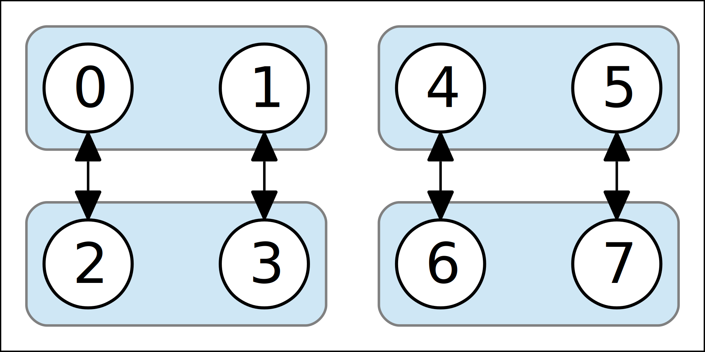
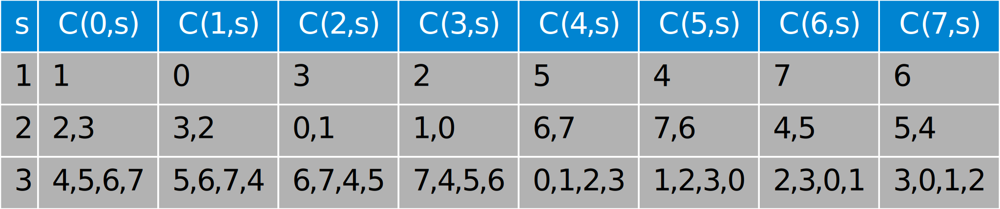

# Trabalho prático 2

## Proposta

**Implementar as duas versões do VCube usando o ambiente de simulação SMPL**

* **Na versão 1**, em cada intervalo de testes, cada processo correto executa testes em 1 cluster sequencialmente até encontrar um processo correto, ou testar todos os processos falhos.
  * Tendo testado um processo correto, obtém informações sobre os processos restantes do cluster (aqueles que não testou) a partir do processo correto testado.
* **Na versão 2**, são definidos de antemão com o uso da função `C(i,s)` executada por e para todos os processos quem são os testadores de quais processos.
  * Esta estratégia garante NlogN testes a cada logN rodadas de testes.
  * Ao testar um processo correto, o testador obtém informações sobre qualquer “novidade” que o processo testado tenha
    * Sugestão para implementar na simulação (em um sistema real não seria boa ideia): simplesmente compare os vetores State do testador com o testado procurando entradas com maior valor.
* Vamos manter a mesma definição de rodada para as duas versões: todos os processos corretos executaram testes em 1 de seus clusters.
* Mostre resultados para diversos valores de N e diversos eventos
  * Um evento em um processo de cada vez, um evento só ocorre depois do evento anterior ser diagnosticado.
  * Para cada evento mostre claramente o número de testes executados e a latência para completar o diagnóstico do evento.
* Cada nodo mantém o vetor `STATE[0..N-1]` de contadores de eventos
  * `STATE[0..N-1]` é inicializado em -1 (estado “unknown”)
  * Assume-se que os processos são inicializados sem-falha
    * A entrada correspondente ao próprio processo no vetor `STATE[]` do testador é setada para zero.
  * Ao descobrir um novo evento em um nodo testado, o testador incrementa a entrada correspondente no vetor `STATE[]`.

## Códigos

* [Código VCube V1](VCubeV1.c)
  * Execução: `VCubeV1 <numero de processos> <tempo de execução>`
* [Código VCube V2](VCubeV2.c)
  * Execução: `VCubeV2 <numero de processos> <tempo de execução>`
* [cisj.c](cisj.c) 
* [cisj.h](cisj.h) 

## Logs

**Log 1:**

* 6 processos
* Tempo de simulação > 930
* Falhas
  * processo 1 no instante 31
  * processo 2 no instante 185
  * processo 4 no instante 370
* Recuperações
  * processo 2 no instante 271
  * processo 4 no instante 460
  * processo 1 no instante 550

[VCubeV1](saidaV1-1.txt) | [VCubeV2](saidaV2-1.txt)

**Log 2:**

* 32 processos
* Tempo de simulação > 1050
* Falhas
  * processo 1 no instante 31
  * processo 2 no instante 301
  * processo 4 no instante 601
* Recuperações
  * processo 2 no instante 451
  * processo 4 no instante 751
  * processo 1 no instante 901

[VCubeV1](saidaV1-2.txt) | [VCubeV2](saidaV2-2.txt)

## VCube V1

### Como funciona?

Para facilitar a compreensão, as figuras abaixo ilustram o funcionamento do VCube V1. No VCube os testes são feitos de acordo com os clusters em que os processos são organizados. No exemplo a seguir, com 8 processos, a primeira rodada de testes compreende 2 processos fazendo testes mutuamente, conforme a Figura 1, onde as setas representam os testes.


Figura 1 - Primeira rodada

Em seguida, será executada a segunda rodada de testes onde cada processo testará os outros dentro do cluster até encontrar um correto. Encontrando um processo correto, o testador obtém informação (a partir do processo testado) sobre os demais **dentro do cluster** (informações conhecidas à partir do teste anterior). A Figura 2 ilustra essa etapa (a área azul representa informações que podem ser obtidas a partir de cada processo correto, por exemplo: quando o processo 0 testa o 2, é possível obter informação sobre o 3).



Figura 2 - Segunda rodada

Para 8 processos temos ainda o terceiro cluster que proporcionará uma terceira rodada de testes. O funcionamento é análogo ao da rodada anterior. Cada processo testa os processos dentro do cluster até encontrar um correto e a partir dele obtém informações sobre os outros processos dentro do cluster.


Figura 3 - Terceira rodada

A cada teste, o vetor `STATE[]` de cada processo é atualizado identificando o processo testado como falho ou correto. Ao encontrar um processo correto, se este tiver informações mais recentes sobre os demais processos dentro do cluster em questão, o processo testador obtém essas informações e atualiza também seu vetor State com elas.

### Implementação

* Há N nodos (processos)
  * N e o tempo de execução são definidos durante o disparo do programa: `VRing <numero de processos> <tempo de execução>`
* Para definir o número de clusters em função do número de processos (N), utiliza-se o teto da função `Log2(N)`
* Cada processo conta o "tempo" independentemente
* Há três tipos de eventos:
  * `test` (teste)
  * `fault` (falha)
  * `recovery` (recuperação)
* O intervalo entre os testes é de 30 unidades de tempo
* Cada processo correto executa testes até achar outro processo correto dentro do cluster
  * Quando um processo correto testa outro processo correto, obtém as informações de diagnóstico do processo testado sobre todos os processos do cluster exceto aqueles que testou nesta rodada.
* Cada processo mantém localmente o vetor `State[N]`
  * `State[N]` é inicializado com -1 (indicando estado “unknown”) para todos os demais processos e 0 para o próprio processo.
  * Ao executar um teste, o processo atualiza a entrada correspondente no vetor `State[N]`.
  * Em cada intervalo de testes, é mostrado o vetor `State[N]`.
* Cada processo mantém localmente o seu `cluster_atual` (onde irá testar), que é inicializado com 1 (primeiro cluster).
* Aproveitando os recursos da biblioteca SMPL, ao criar a `struct TipoProcesso`, coloca-se nela um campo chamado `id` que receberá um identificador de facility (recurso) do SMPL.
* `processo` é o vetor do tipo `TipoProcesso` que apontara para cada um dos processos criados.
* O programa receberá como `argv[1]` durante sua chamada o número de processos para a simulação.
* Os eventos no programa serão agendados através da função `schedule(int ev, real te, int tkn)`.
* Há um loop `while` no código que executa enquanto o tempo for menor que o programado como duração da simulação.
* Utilizam-se 3 tipos de eventos `test` (teste), `fault` (falha) e `recovery` (recuperação).
  * Para testar um evento é usada a função `int status(int f)` que retorna 0 em caso de um processo correto um valor diferente de 0 para um processo falho.
  * Para tornar um processo falho, utiliza-se a função `int request(int f, int tkn, int pri)` que reserva a facility do processo e torna `status != 0`.
  * Para mudar o estado de um processo para recuperado, utiliza-se a função `void release(int f, int tkn)` que libera a facility ocupada pelo processo e torna `status = 0`.
  * A função `void cause(int *ev, int *tkn)` é responsável por disparar cada um dos eventos agendados.
* Para facilitar a compreensão do código, são definidas duas variáveis: `num_processo_atual` que recerá o valor de `token` (relativo ao processo atual) e `indice_dentro_do_cluster`, que contem o índice do elemento relativo a outro processo dentro do seu `cluster_atual`.
* Há também uma lista dos processos presentes no `cluster_atual` do tipo `node_set*` que armazena o resultado da função `C(i,s)` onde `i` é o número do processo atual e `s` é o cluster a ser analizado.
* Cada processo mantém um vetor de estados `State[]` dos demais processos, indicando se eles tem valor desconhecido (-1), estão corretos (valor par) ou falhos (valor ímpar)
  * Para a criação/inicilização do vetor `State` são utilizados 2 laços `for` aninhados. O externo corresponde a iteração entre cada processo e o interno corresponde a iteração entre cada posição no vetor `State` do estado em questão.
  ```c
  for (i=0;i<N;i++) {
      processo[i].State = (int*) malloc(sizeof(int)*N);
      for (int j=0; j < N; j++) {
          if (i==j) {
              processo[i].State[j]=0;
          }
          else{
              processo[i].State[j]=-1;
          }
      }
  }
  ```
* Para satisfazer a condição de que um processo correto irá executar testes até achar outro processo correto dentro do cluster, foi utilizado um loop `for` que verifica o estado de cada processo, iterando pelo índice dentro do cluster, enquanto o processo `num_processo_em_teste` estiver falho.
  * Quando um processo correto é encontrado, a variável `num_processo_testado_correto` é atualizada com o valor de `num_processo_em_teste`
    * Ao sair do laço de verificação de um processo correto no cluster, é necessário atualizar a posição correspondente ao processo correto dentro da variável State do processo testador.
      * Se o processo testado tiver um valor ímpar no vetor `STATE[]` do testador, seu valor será incrementado, tornando-o par (representando um processo correto).
    * Em seguida, o processo testador obtém as informações de diagnótico dos demais processos do cluster atual com o processo testado correto (exceto os que ele já testou).
        * Para isso, ele verifica se os processos não testados dentro do cluster atual tem um valor maior no vetor `State` do processo testado. Se sim, o processo testador atualiza seu próprio vetor `State` com esses valores.
    * Quando um processo falho é encontrado, faz-se uma verificação de seu estado no vetor `STATE[]` do processo testador
      * Se o valor no State do processo testador for -1 (desconhecido), ele é atualizado para 1 (processo falho).
      * Senão, se o seu valor for par (processo correto), ele é incrementado para um número ímpar (processo falho).
      * Para tratar o caso em que todos os demais processos estão falhos, é feita a seguinte verificação `if (num_proximo_processo==num_processo_atual)` e nesse caso é exibida uma mensagem avisando que há um único processo correto.
    * Antes de iniciar o loop `for` o valor de `num_processo_testado_correto` é igualado ao de `num_processo_atual`. Isso serve para detectar o caso em que não foi detectado outro processo correto dentro do loop e portanto não há nenhum processo correto no cluster. Nesse caso, é exibida uma mensagem avisando de tal situação.
  * Ao final da checagem de um processo correto dentro do cluster, o valor do `cluster_atual` do processo que testou é incrementado. No caso em que ele atingiu o valor relativo ao número total de clusters, ele retorna a 1 (primeiro cluster)
* Há algumas variáveis usadas para estatística no programa. Elas são:
  * `int conta_testes` que é inicializada com o valor 0 e serve para contar os testes que ocorrem desde o início de um evento até seu diagnóstico por todos os processos.
  * `int conta_bateria_testes` que é inicializada com o valor 0 e serve para contar uma "execução" completa de um processo correto: achou um outro processo correto ou passou por todos os processos falhos
  * `int monitor_de_evento` que guarda qual é o evento a ser monitorado no momento (falha ou recuperação). É inicializada com "`no_event`" e volta a esse estado quando um evento foi diagnosticado por todos os procesos
  * `int processo_foco` que armazena o número relativo ao processo que falhou ou recuperou
  * `double tempo_inicio_evento` que armazena o tempo de início de um evento de falha ou recuperação
  * `int processos_com_falha` é um contador de processos falhos e é inicializado com o valor 0
* Para exibir número de testes executados e a latência para completar o diagnóstico de cada evento
  * Primeiro é estabelecido qual o evento que o `monitor_de_evento` está guardando.
    * Se for falha, para cada processo correto, verifica-se se seu vetor State na posição relativa ao `processo_foco` possui um valor ímpar. Se sim, o `contador_processos` é incrementado, significando que um processo correto já identificou a falha.
    * Se for recuperação, para cada processo correto, verifica-se se seu vetor State na posição relativa ao `processo_foco` possui um valor par. Se sim, o `contador_processos` é incrementado, significando que um processo correto já identificou a recuperação.
  * Em seguida, verifica-se se o contador de processos atingiu o valor equivalente ao número de processos menos os `processos_com_falha`
    * Se sim, é impressa uma mensagem explicitando que o evento foi detectado por todos os outros processos, exibindo quantos testes foram executados (`conta_testes`), em quantas rodadas(o teto da divisão de `conta_bateria_testes` pelo número de processos corretos) e em qual instante. É exibida a quantidade de tempo que levou para detecção subtraindo do tempo atual, o `tempo_inicio_evento`.
  * Por fim, o monitor de eventos recebe novamente o estado `no_event` e `conta_testes` é zerado.
* Sempre que uma falha ou uma recuperação acontece, `monitor_de_evento` vai receber o evento em questão, `processo_foco` recebe o token (ou número do processo com falha), `conta_testes` e `conta_bateria_testes` são zerados e `tempo_inicio_evento` recebe o tempo atual através da função `time()`.
* Quando o evento é uma falha, o vetor de estados State do processo falho é resetado.

## VCube V2

### Como funciona?

O VCube V2 parte da função `C(i,s)` que apresenta o s-ésimo cluster no processo i, ou seja retorna a lista de processos (em ordem) que devem ser testados pelo testador i nos clusters `s=1, 2, …, logN`. A Figura 4 apresenta a tabela `C(i,s)` para 8 processos.



Figura 4 - Tabela com os resultados de `C(i,s)` para 8 processos

A partir dos dados de `C(i,s)` são definidos os testadores de cada processo com a função. Cada processo tem 1 testador por cluster: o primeiro processo correto da `C(i,s)`.

Um ponto importante! Ao testar um processo correto: o testador obtém informações sobre **todos** os demais processos do cluster que não testou neste intervalo.

### Implementação

* Há N nodos (processos)
  * N e o tempo de execução são definidos durante o disparo do programa: `VRing <numero de processos> <tempo de execução>`
* Para definir o número de clusters em função do número de processos (N), utiliza-se o teto da função `Log2(N)`
* Cada processo conta o "tempo" independentemente
* O intervalo entre os testes é de 30 unidades de tempo
* Cada processo correto executa testes até achar outro processo correto dentro do cluster
  * Quando um processo correto testa outro processo correto, obtém as informações de diagnóstico do processo testado sobre todos os processos do cluster exceto aqueles que testou nesta rodada.
* Cada processo mantém localmente o vetor `State[N]`
  * `State[N]` é inicializado com -1 (indicando estado “unknown”) para todos os demais processos e 0 para o próprio processo.
  * Ao executar um teste, o processo atualiza a entrada correspondente no vetor `State[N]`.
  * Em cada intervalo de testes, é mostrado o vetor `State[N]`.
* Cada processo mantém localmente o seu `cluster_atual` (onde irá testar), que é inicializado com 1 (primeiro cluster).
* Aproveitando os recursos da biblioteca SMPL, ao criar a `struct TipoProcesso`, coloca-se nela um campo chamado `id` que receberá um identificador de facility (recurso) do SMPL.
* `processo` é o vetor do tipo `TipoProcesso` que apontara para cada um dos processos criados.
* O programa receberá como `argv[1]` durante sua chamada o número de processos para a simulação.
* Os eventos no programa serão agendados através da função `schedule(int ev, real te, int tkn)`.
* Há um loop `while` no código que executa enquanto o tempo for menor que o programado como duração da simulação.
* Utilizam-se 3 tipos de eventos `test` (teste), `fault` (falha) e `recovery` (recuperação).
  * Para testar um evento é usada a função `int status(int f)` que retorna 0 em caso de um processo correto um valor diferente de 0 para um processo falho.
  * Para tornar um processo falho, utiliza-se a função `int request(int f, int tkn, int pri)` que reserva a facility do processo e torna `status != 0`.
  * Para mudar o estado de um processo para recuperado, utiliza-se a função `void release(int f, int tkn)` que libera a facility ocupada pelo processo e torna `status = 0`.
  * A função `void cause(int *ev, int *tkn)` é responsável por disparar cada um dos eventos agendados.
* Para facilitar a compreensão do código, são definidas duas variáveis: `num_processo_atual` que recerá o valor de `token` (relativo ao processo atual) e `indice_dentro_do_cluster`, que contem o índice do elemento relativo a outro processo dentro do seu `cluster_atual`.
* Há também uma lista dos processos presentes no `cluster_atual` do tipo `node_set*` que armazena o resultado da função `C(i,s)` onde `i` é o número do processo atual e `s` é o cluster a ser analizado.
* Cada processo mantém um vetor de estados `State[]` dos demais processos, indicando se eles tem valor desconhecido (-1), estão corretos (valor par) ou falhos (valor ímpar)
  * Para a criação/inicilização do vetor `State` são utilizados 2 laços `for` aninhados. O externo corresponde a iteração entre cada processo e o interno corresponde a iteração entre cada posição no vetor `State` do estado em questão.
  ```c
  for (i=0;i<N;i++) {
      processo[i].State = (int*) malloc(sizeof(int)*N);
      for (int j=0; j < N; j++) {
          if (i==j) {
              processo[i].State[j]=0;
          }
          else{
              processo[i].State[j]=-1;
          }
      }
  }
  ```
* Foi utilizado um loop `for` que intera por todos os processos e busca seus testadores através da função C(i.s).
  * Os testadores de cada processo `y` são armazenados em uma lista chamada `testadores_de_y`
  * Em seguida, para a lista de testadores de cada um dos processos, verifica-se se o testador é o processo atual. Para tal, considera-se que o testador é o primeiro processo correto da lista de testadores de y (correto de acordo com o vetor State do processo atual, ou seja, valor par).
    * Se o processo atual é o primeiro processo correto na lista de testadores de `y`), o processo atual (testador) verifica o status do processo `y` e atualiza seu vetor state.
      * No caso de `y` estar correto:
          * Se o processo testado tiver um valor ímpar no vetor `STATE[]` do testador, seu valor será incrementado, tornando-o par (representando um processo correto).
          * Em seguida, o processo testador compara seu vetor State com o de `y` e atualiza com os valores que forem maiores no vetor State de `y`
      * No caso de `y` estar falho, faz-se uma verificação de seu estado no vetor `STATE[]` do processo testador
        * Se o valor no State do processo testador for -1 (desconhecido), ele é atualizado para 1 (processo falho).
        * Senão, se o seu valor for par (processo correto), ele é incrementado para um número ímpar (processo falho).
        * Para tratar o caso em que todos os demais processos estão falhos, é feita a seguinte verificação `if (num_proximo_processo==num_processo_atual)` e nesse caso é exibida uma mensagem avisando que há um único processo correto.
    * Caso outro processo seja o testador de `y` (é o primeiro correto, de acordo com o valor presente no state do processo atual), o processo atual não testa o processo `y` pois outro processo atua como testador de `y`.
* O valor do `cluster_atual` do processo que testou é incrementado. No caso em que ele atingiu o valor relativo ao número total de clusters, ele retorna a 1 (primeiro cluster)

* Há algumas variáveis usadas para estatística no programa. Elas são:
  * `int conta_testes` que é inicializada com o valor 0 e serve para contar os testes que ocorrem desde o início de um evento até seu diagnóstico por todos os processos.
  * `int conta_bateria_testes` que é inicializada com o valor 0 e serve para contar uma "execução" completa de um processo correto: achou um outro processo correto ou passou por todos os processos falhos
  * `int monitor_de_evento` que guarda qual é o evento a ser monitorado no momento (falha ou recuperação). É inicializada com "`no_event`" e volta a esse estado quando um evento foi diagnosticado por todos os procesos
  * `int processo_foco` que armazena o número relativo ao processo que falhou ou recuperou
  * `double tempo_inicio_evento` que armazena o tempo de início de um evento de falha ou recuperação
  * `int processos_com_falha` é um contador de processos falhos e é inicializado com o valor 0
* Para exibir número de testes executados e a latência para completar o diagnóstico de cada evento
  * Primeiro é estabelecido qual o evento que o `monitor_de_evento` está guardando.
    * Se for falha, para cada processo correto, verifica-se se seu vetor State na posição relativa ao `processo_foco` possui um valor ímpar. Se sim, o `contador_processos` é incrementado, significando que um processo correto já identificou a falha.
    * Se for recuperação, para cada processo correto, verifica-se se seu vetor State na posição relativa ao `processo_foco` possui um valor par. Se sim, o `contador_processos` é incrementado, significando que um processo correto já identificou a recuperação.
  * Em seguida, verifica-se se o contador de processos atingiu o valor equivalente ao número de processos menos os `processos_com_falha`
    * Se sim, é impressa uma mensagem explicitando que o evento foi detectado por todos os outros processos, exibindo quantos testes foram executados (`conta_testes`), em quantas rodadas (`conta_bateria_testes` dividido pelo número de processos válidos) e em qual instante. É exibida a quantidade de tempo que levou para detecção subtraindo do tempo atual, o `tempo_inicio_evento`.
  * Por fim, o monitor de eventos recebe novamente o estado `no_event` e `conta_testes` é zerado.
* Sempre que uma falha ou uma recuperação acontece, `monitor_de_evento` vai receber o evento em questão, `processo_foco` recebe o token (ou número do processo com falha), `conta_testes` e `conta_bateria_testes` são zerados e `tempo_inicio_evento` recebe o tempo atual através da função `time()`.
* Quando o evento é uma falha, o vetor de estados State do processo falho é resetado.

# Licença

Este código está liberado sob a licença MIT. O texto dela (em inglês) encontra-se [neste arquivo](../LICENSE.md).
