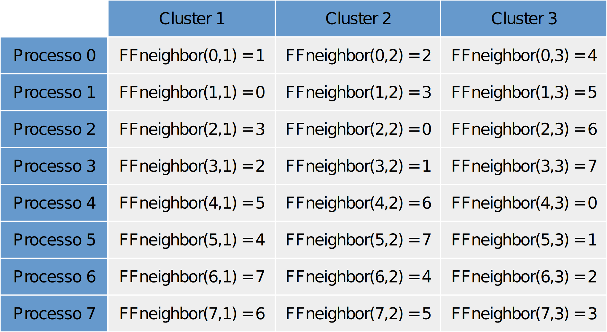
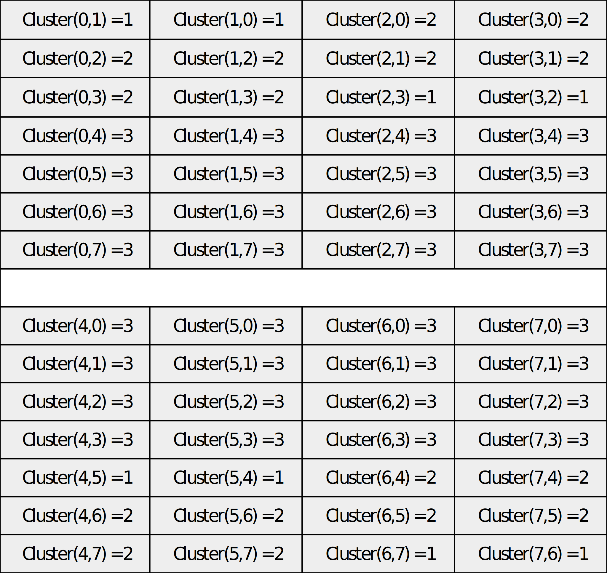

# Trabalho prático 3

## Proposta

**Implementar o algoritmo de Best-Effort Broadcast sobre o VCube.**

* O programa deve receber como entradas:
  * o processo fonte do broadcast;
  * o número de nodos do sistema e
  * uma lista de nodos para falhar
    * durante toda a execução
    * em momentos específicos
* Deve ser possível fazer uma execução com escalonamento de falhas definidas aleatoriamente.
  * Quando se executa o algoritmo usando esta abordagem, processos escolhidos aleatoriamente vão falhar entre o início e o fim do broadcast.
* Atenção pessoal: fazer o VCube com processos testando todos os logN clusters em todos os intervalos de teste. Além disso, ao testar um processo sem falha o testador obtém todas as "novidades" do testado (não apenas do cluster do testado). A estratégia de testes propriamente dita pode ser tanto to VCube original como do VCube versão 2, vcs escolhem.
* No relatório, explique cuidadosamente como vc implementou cada função e o algoritmo como um todo.
* Mostre os logs com cuidado, de forma que seja possível ver com clareza o progresso do broadcast, inclusive após a ocorrência de falhas.
* Um caso que deve estar nos logs é o seguinte: um processo aguarda o ACK de outro processo. Em seguida (antes de receber o ACK) o processo que deveria mandar o ACK falha. Agora o processo que aguardava o ACK deve mandar uma nova mensagem para outro processo do cluster do processo que falhou (Cenário 8). Deve ser fácil visualizar toda esta situação no seu log!

## Códigos

* [Código Best-Effort Broadcast sobre VCube](BEBCVCube.c)
  * Execução: `BEBCVCube <nome do arquivo de entrada>`  
* [int\_set.h](int_set.h) (retirado [daqui](https://github.com/fontoura/int_set_adt_in_c))
* [int\_set.c](int_set.c) 
* [token\_agrupada.h](token_agrupada.h) (retirado [daqui](https://github.com/fontoura/token-agrupada-smpl))
* [token\_agrupada.c](token_agrupada.c) 
* [cisj.c](cisj.c) (retirado [daqui](https://www.inf.ufpr.br/elias/sisdis/cisj.c.txt))
* [cisj.h](cisj.h) 

## Formato do arquivo de entrada

```
nodos <numero de nodos>
tempo <tempo total de simulação>
fonte <processo origem do broadcast> <tempo de inicio do broadcast>
falha <processo que irá falhar> <tempo de falha>
falha <processo que irá falhar> <tempo de falha>
falha <processo que irá falhar> <tempo de falha>
...
```

Considerações:
* Para processos que iniciam falhos (e permanecem falhos) durante toda a execução, usar o valor 0 em `<tempo de falha>`
* Para processos que falham em momentos específicos, usar o valor relativo ao momento em `<tempo de falha>`
* Para escalonamento de falhas definidas aleatoriamente, usar o valor -1 para `processo que irá falhar` e -1 para `tempo de falha`. A quantidade de falhas vai depender da quantidade de linhas com essa característica
  * O tempo de simulação deve ser maior que os momentos em que as falhas ocorrem
  * As falhas são detectadas pela execução do VCube v.2 rodando ao mesmo que tempo que o BEBCast, então leva algum tempo até sua detecção: os processos não as detectam imediatamente após a ocorrência.
  * O número de falhas não é fixo, basta criar mais ou menos linhas com eventos de falha
  * O número de falhas listadas deve ser compatível com a execução do BEBCast. Se todos os processos falharem, não há como fazer broadcast ¯\\\_(ツ)\_/¯

## Logs

**Cenário 1:**

* 8 processos
* Processo que inicia o BEBCast: 0
* Sem falhas

[Entrada 1](entrada1.txt) | [Saída 1](saida1.txt)  
  
**Cenário 2:**

* 16 processos
* Processo que inicia o BEBCast: 0
* Sem falhas

[Entrada 2](entrada2.txt) | [Saída 2](saida2.txt)  
  
**Cenário 3:**

* 32 processos
* Processo que inicia o BEBCast: 0
* Sem falhas

[Entrada 3](entrada3.txt) | [Saída 3](saida3.txt)  
  
**Cenário 4:**

* 8 processos
* Processo que inicia o BEBCast: 0
* Falhas
  * processo 2
  * processo 4
  * processo 5

Tempo de falha início da simulação: [Entrada 4.1](entrada4.txt) | [Saída 4.1](saida4.txt)  

Tempo de falha predefinido: [Entrada 4.2](entrada4-2.txt) | [Saída 4.2](saida4-2.txt)  

Tempo de falha aleatório: [Entrada 4.3](entrada4-3.txt) | [Saída 4.3](saida4-3.txt)  
  
 **Cenário 5:**

* 8 processos
* Processo que inicia o BEBCast: 7
* Falhas
  * processo 3
  * processo 1

Tempo de falha início da simulação: [Entrada 5.1](entrada5.txt) | [Saída 5.1](saida5.txt)  

Tempo de falha predefinido: [Entrada 5.2](entrada5-2.txt) | [Saída 5.2](saida5-2.txt)  

Tempo de falha aleatório: [Entrada 5.3](entrada5-3.txt) | [Saída 5.3](saida5-3.txt)  

**Cenário 6:**

* 16 processos
* Processo que inicia o BEBCast: 0
* Falhas
  * processo 2
  * processo 8
  * processo 9
  * processo 12

Tempo de falha início da simulação: [Entrada 6.1](entrada6.txt) | [Saída 6.1](saida6.txt)  

Tempo de falha predefinido: [Entrada 6.2](entrada6-2.txt) | [Saída 6.2](saida6-2.txt)  

Tempo de falha aleatório: [Entrada 6.3](entrada6-3.txt) | [Saída 6.3](saida6-3.txt)  
  
**Cenário 7:**

* 32 processos
* Processo que inicia o BEBCast: 16
* Falhas
  * processo 0
  * processo 2
  * processo 4
  * processo 8

Tempo de falha início da simulação: [Entrada 7.1](entrada7.txt) | [Saída 7.1](saida7.txt)  

Tempo de falha predefinido: [Entrada 7.2](entrada7-2.txt) | [Saída 7.2](saida7-2.txt)  

Tempo de falha aleatório: [Entrada 7.3](entrada7-3.txt) | [Saída 7.3](saida7-3.txt)  
  
**Cenário 8:**

* 8 processos
* Tempo de simulação: 250
* Processo que inicia o BEBCast: 0
* Inicio da transmissão do BEBCast: tempo 100.0
* Falhas
  * processo 2 no instante 102.5

[Entrada 8](entrada8.txt) | [Saída 8](saida8.txt)

## Como funciona o Best-Effort Broadcast

Da mesma forma que o VCube, o BEBCast também utiliza o conceito de clusters para organizar as comunicações entre os processos. Na Figura 1, é exibido um exemplo, com 8 processos, onde são marcados os clusters 1, 2 e 3 do processo 0.  


Figura 1 - Os três clusters do processo 0

Vamos considerar que seja o processo 0 quem inicia o BEBCast. Primeiramente ele faz o deliver da mensagem. Ele irá mandar mensagens apenas para o primeiro processo correto de cada um de seus clusters. Para isso existe uma função chamada `FFneighbor(i, s)`, que retorna o primeiro processo correto do cluster `s` do processo `i`. No caso de 8 processos corretos, seus resultados seriam os seguintes:  



Figura 2 - Resultados da função FFneighbor para um conjunto de 8 processos onde todos estão corretos

Após mandar as mensagens, o processo origem adiciona os números dos processos que a receberam em uma lista que ACKs pendentes, os quais ele irá aguardar. Ao receber uma mensagem, o processo destinatário faz o deliver da mensagem, determina o cluster a que pertence em relação ao processo de origem da mensagem e guarda o número do processo de origem da mensagem (para responder com ACK posteriormente). Para fazer a determinação do cluster, utiliza-se a função `Cluster(i, j)` que retorna a qual cluster de `j`, o processo `i` pertence. A Figura 3 mostra os resultados dessa função para todos os processos.



Figura 3 - Resultados da função Cluster(i, j) para 8 processos

Em seguida, para cada cluster seu, cujo número seja menor que o cluster de origem - 1, ele irá enviar a mensagem para o primeiro processo correto, quando houver, (utilizando a função `FFneighbor`) e adicioná-lo em sua própria lista de ACKs pendentes.  
  
Quando um processo verifica que sua lista de ACKs pendentes está vazia (ou seja, todos os processos que lhe "deviam" um ACK já responderam), se ele não for o processo que iniciou o broadcast, ele mesmo pode enviar um ACK ao processo que lhe enviou a mensagem.  
  
Quando um processo recebe um ACK, por sua vez, ele verifica quem o enviou e remove o ACK da sua lista de ACKs pendentes  
  
Quando a lista de ACKs pendentes do processo de origem esvazia, é porque o broadcast terminou.  
  
Um exemplo de uma execução completa pode ser visto na Figura 4. O processo 0 encaminha mensagens ao primeiro processo correto de seus três custers: 1 (em magenta), 2 (em verde) e 4 (em azul) e fica aguardando ACKs desses processos. O processo 2, por pertencer ao cluster 2 do processo 1, tem que encaminhar a mensagem ao primeiro processo correto de seu cluster 1 (todos os clusters com valor inferior ao do processo de origem -1), sendo assim, ele encaminha a mensagem para o processo 3 (também em verde) e aguarda seu ACK. O processo 3 pertence ao cluster 1 do processo 2, e dessa forma não precisa encaminhar a mensagem a mais nenhum processo, pois pertence ao cluster 1 do processo de origem, então, já pode responder com ACK ao processo 2. Este, tendo recebido ACK de 3 e estando agora com sua lista de ACKs pendentes vazia, pode encaminhar um ACK ao processo 0, de quem recebeu a mensagem. O processo 0 remove o processo 2 da lista de ACKs pendentes. O processo 4 recebe a mensagem (em azul) e faz parte do cluster 3 do processo 0, por isso ele deve encaminhar a mensagem ao primeiro processo correto do seu cluster de número 2 (processo 6) e número 1 (processo 5) e aguardar os respectivos ACKs. O processo 5 faz parte do cluster 1 do processo 4 e portanto não precisa encaminhar a mensagem, apenas responder com ACK. O processo 4 pode remover o processo 5 da lista de ACKs pendentes. O processo 6, por sua vez, precisa encaminhar ao seu primeiro processo correto do cluster de número 1, que é o 7 (em laranja) e esperar pelo ACK correspondente. O processo 7 recebe a mensagem e como não tem para quem encaminhar, manda o ACK ao processo 6. Este, recebe o ACK, remove o processo 7 da lista de ACKs pendentes e, estando com sua lista de ACKs pendentes vazia, manda um ACK ao processo 4. Este remove o processo 6 da lista de ACKs pendentes e tendo ela esvaziado, o processo 4 pode enviar um ACK ao processo 0. O processo 0, neste ponto já recebeu todos os ACKs necessários, então ele esvazia sua lista de ACKs pendentes e termina o BEBCast.  


Figura 4 - Exemplo de execução de BEBCast

Em caso de falha em algum processo, se a lista de ACKS pendentes do processo atual contiver o processo que falhou, ele é removido e quando possível, o processo atual reenvia a mensagem para outro processo correto no mesmo cluster do processo que falhou. Através da função `FFneighbor` é encontrado o novo primeiro processo correto no cluster, enviada uma mensagem a ele e adicionado seu número à lista de ACKs pendentes do processo atual. O algoritmo segue a partir do novo processo que recebeu a mensagem ou, se ele não existir, o processo atual manda um ACK ao processo de quem recebem a mensagem.  
Como para esta simulação é executado apenas um fluxo de broadcast por vez, não é necessário criar uma lista de mensagens entregues (delivered), apenas ter controle se a mensagem já foi entregue ou não.

## Implementação

* Para receber os parâmetros de entrada, é feita a leitura de um arquivo de texto cujo modelo está exposto na seção _Formato do arquivo de entrada_
* São utilizadas três bibliotecas auxiliares:
    * [cisj.h](cisj.h): função `C(i,s)` que recebe o número de um processo `i`, um número de cluster `s` e retorna os processos que pertencem a esse cluster
    * [int\_set.h](int_set.h): contém funções úteis para trabalhar com um conjunto de inteiros - adicionar e remover de elementos no conjunto, verificar se um elemento está presente, obter o n-ésimo elemento, obter o tamanho do conjunto e limpar o conjunto.
    * [token\_agrupada.h](token_agrupada.h): agrupa e separa elementos no token, uma vez que é necessário trabalhar com mais de um parâmetro
* Este trabalho parte do código do [Trabalho 2](../Trabalho2/Trabalho2.html) que contém o VCube (sua única modificação é que cada processo testa todos os clusters em todas as rodadas). A ele foram adicionados 4 eventos:
  * `bebcast`: início do broadcast
  * `rcvmsg`: recebimento de uma mensagem
  * `rcvack`: recebimento de um ACK
  * `failed`: detecção de falha em um processo
* Foram adicionadas também duas funções:
  * `int FFneighbor(int i, int s)` que retorna o primeiro processo correto do cluster s do processo i: ela parte do resultado gerado por `cis(i,s)` da biblioteca `cisj` e para cada processo no cluster, verifica se ele está dentro do número de processos informados no arquivo de entrada e se ele está correto. Satisfazando essas condições, retorna o número desse processo, senão retorna -1 (para o caso em que um processo correto não foi encontrado)
  * `Cluster(int i, int j)` que retorna a qual cluster de `j`, o processo `i` pertence: para cada cluster de j, verifica se o processo i pertence aos processos do cluster.
* A struct `TipoProcesso` recebeu 4 novos atributos
  * `int_set PendingACK` que é o conjunto de processos que estão "devendo" ACK ao processo atual
  * `int remetente` que é o processo para o qual o processo atual está "devendo" o ACK
  * `int origem_broadcast` que é o processo origem do broadcast
  * `int delivered` que é uma "flag" que marca se a mensagem já foi entregue ou não
* Para a geração de número de processos falhos e tempo de falha aleatórios, foram utilizadas as funções:
  * `randomic(0,N-1)` onde o intervalo vai de 0 a N (número de processos) - 1
  * `uniform(tempo_inicio-numero_clusters(N),tempo_inicio+numero_clusters(N))` onde o intervalo de falha é definido como `tempo_inicio` do evento de broadcast com uma tolerância de mais ou menos o número de clusters, para comprovar a continuidade da execução do BEBCast durante eventos de falha assim como a retransmissão das mensagens a processos corretos.
* Os novos eventos são descritos a seguir.
  * `bebcast`:
    * Recebe como token o processo que irá iniciar o broadcast.
    * Confere se o processo está correto. Se não estiver, não prossegue com o broadcast.
    * Como o processo que inicia o broadcast não precisa responder com ACK para nenhum outro, seu `remetente` recebe o valor -1 e a `origem_broadcast` recebe o número do token (que é o próprio processo atual)
    * O processo faz o deliver da mensagem e altera seu indicador de mensagem entregue (`delivered`) de 0 para 1.
    * Em seguida, para cada cluster, determina-se qual processo deve receber a mensagem usando a função `FFneighbor`. Ela irá retornar o número do processo (caso ele exista) ou -1 (caso contrário).
      * É agendado um evento `rcvmesg` para os processos que devem receber a mensagem com um token agrupado contendo número do processo origem do broadcast, o número do processo atual (são iguais para o bebcast) e número do processo destino. Esse agrupamento é feito com a função `AGRUPAR_TOKEN3` da biblioteca `token_agrupada`
      * Em seguida, o número de cada processo que vai receber a mensagem é colocado na lista PendingACK do processo atual: a lista que guarda os ACKs que este processo está esperando.
  * `rcvmsg`:
    * Recebe como token o processo origem do broadcast, o processo que enviou a mensagem e o processo atual (destinatário).
    * Separa o token em `origem_broadcast`, `processo_origem` da mensagem e `processo_atual` usando a macro `SEPARAR_TOKEN3` da biblioteca `token_agrupada` e atribui esses valores às respectivas variáveis.
    * Determina o cluster a que o processo atual pertence em relação ao processo de origem da mensagem usando a função `Cluster`
    * Confere se o processo atual está correto
    * Guarda o número do processo remetente da mensagem no atributo `processo_origem` e o número do processo que iniciou o broadcast no atributo `origem_broadcast`
    * Se ainda não tiver entregado, o processo faz o deliver da mensagem.
    * Se o processo remetente e o processo origem do broadcast estiverem corretos (segundo o vetor State do processo atual), para cada cluster cujo número for menor que (cluster da origem - 1), determina qual processo (se houver) deve receber a mensagem usando a função `FFneighbor`
    * Agenda o evento `rcvmsg` para cada processo em questão, enviando como token o número do processo origem do broadcast, o número do processo atual (remetente) e o número do processo de destino. Para isso usa a macro `AGRUPAR_TOKEN3`
    * Adiciona o número de cada processo que vai receber a mensagem no `PendingACK` do processo atual.
    * Verifica se o tamanho da lista de ACKs pendentes é igual a 0. Se for, agenda um evento `rcvack` para o processo de origem.
    * Caso o processo remetente da mensagem ou o processo origem do broadcast estejam falhos, segundo o vetor State do processo atual, é exibida uma mensagem para cada caso.
  * `rcvack`:
    * Recebe como token o processo que enviou a mensagem e o processo atual (destinatário).
    * Separa o token em `processo_origem` da mensagem e `processo_atual` usando a macro `SEPARAR_TOKEN2` da biblioteca `token_agrupada` e atribui esses valores às respectivas variáveis.
    * Confere se o processo atual está correto
    * Remove o processo que mandou o ACK da lista de ACKs pendentes usando a função `int_set__remove` da biblioteca `int_set`
    * Verifica se o tamanho da lista de ACKs pendentes é igual a 0.
      * Se o processo atual não for a origem do broadcast, agenda um evento `rcvack` para o processo do qual recebeu a mensagem.
      * Se o processo atual é a origem do broadcast, sua lista `PendingACK` está vazia, então encerra o broadcast
  * `failed`:
    * Este evento é agendado quando um processo detecta (através do evento `test` do VCube) que outro processo está falho
    * Recebe como token o número do processo atual e o número do processo falho.
    * Separa o token em `processo_atual` e `processo_falho` usando a macro `SEPARAR_TOKEN2` da biblioteca `token_agrupada` e atribui esses valores às respectivas variáveis.
    * Se a lista de ACKs pendentes do processo atual não estiver vazia, este processo está participando do broadcast
      * Verifica se a falha foi no processo de origem ou no processo remetente da mensagem ao processo atual. Para os dois casos, zera a lista de ACKs pendentes do processo atual.
    * Se a lista de ACKS pendentes do processo atual contiver o processo que falhou, remove o processo falho da lista de ACKs pendentes
      * Se for possível, reenvia a mensagem para outro processo no mesmo cluster do processo que falhou avaliando através da função `FFneighbor`
        * Se houver outro processo correto no mesmo cluster do processo falho, envia a mensagem para o outro processo, agenda um evento `rsvmsg` para o destinatário e adiciona o novo processo que vai receber a mensagem na lista de ACKs pendentes
    * Se não houver para quem enviar as mensagens e não estiver esperando nenhum ACK, manda a mensagem de ACK para o processo de quem recebeu a mensagem, agendando um `rcvack`
    * Se o processo atual for quem originou o broadcast e não há ACKs pendendetes, encerra o broadcast

# Licença

Este código está liberado sob a licença MIT. O texto dela (em inglês) encontra-se [neste arquivo](../LICENSE.md).
